<h1 align="center">
  <br>
  <a href="https://github.com/Reon90/redcube">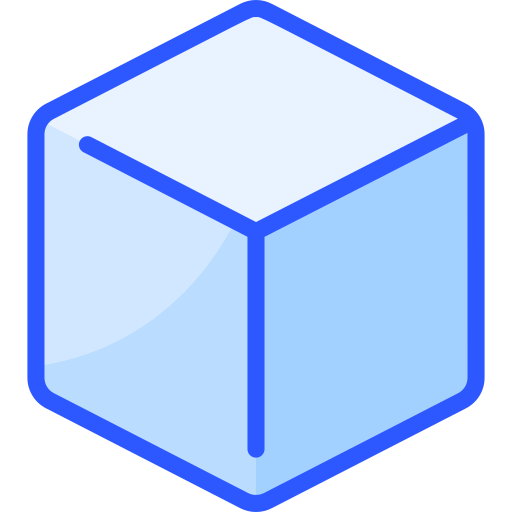</a>
  <br>
  RedCube
  <br>
  <br>
</h1>

<h3 align="center">The GLTF viewer with WebGL2 and WebGPU backends.</h3><br>

<p align="center">
  <a href="https://www.npmjs.com/package/redcube.js"></a>
  
  
  
  
</p>

<div align="center">
  <h3>
    <a href="https://reon90.github.io/redcube">WebGL2 demo</a>
    <span> | </span>
    <a href="https://reon90.github.io/redcube?webgpu=1">WebGPU demo</a>
  </h3>
</div><br>

The javascript rendering library for [Khronos glTF 2.0 format](https://github.com/KhronosGroup/glTF/tree/master/specification/2.0).

## Features

&bull; glTF 2.0 Specification

&bull; KHR_draco_mesh_compression

&bull; KHR_materials_dispersion
<p></p>

&bull; KHR_materials_anisotropy
<p>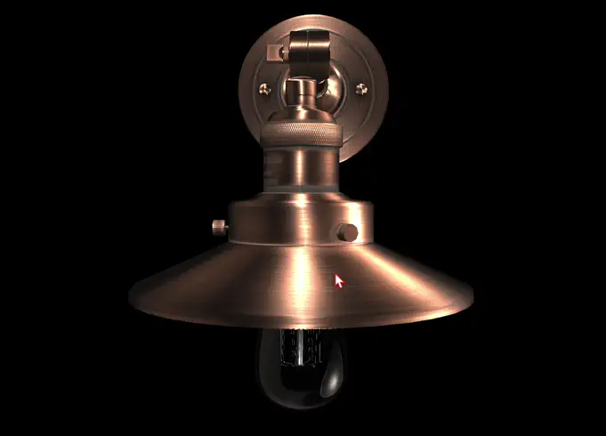</p>

&bull; KHR_materials_diffuse_transmission
<p></p>
&bull; KHR_materials_diffuse_transmission + subsurface scatering
<p>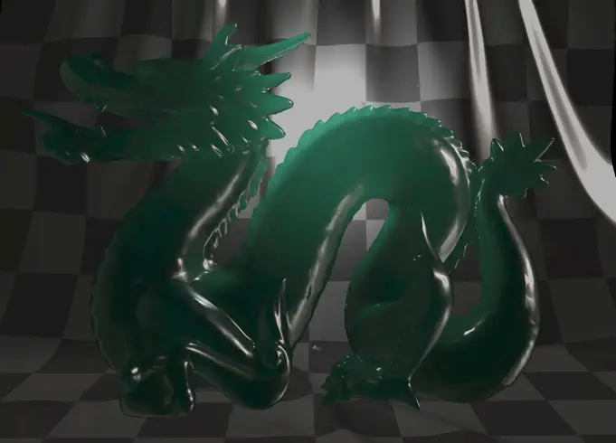</p>

&bull; KHR_lights_punctual
<p>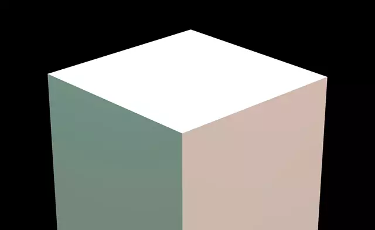</p>

&bull; KHR_materials_clearcoat
<p>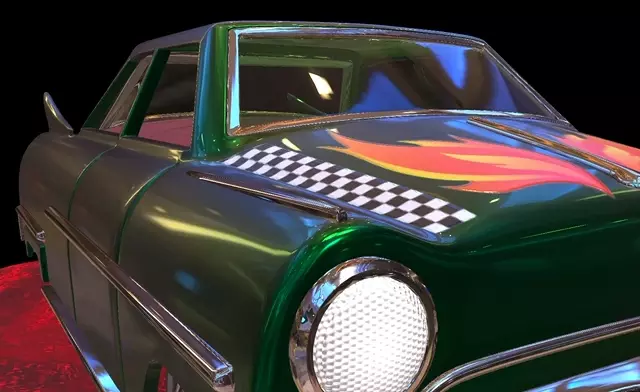</p>

&bull; KHR_materials_pbrSpecularGlossiness

&bull; KHR_materials_sheen
<p></p>

&bull; KHR_materials_transmission
<p>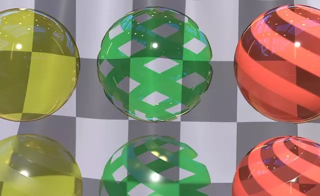</p>

&bull; KHR_materials_volume
<p>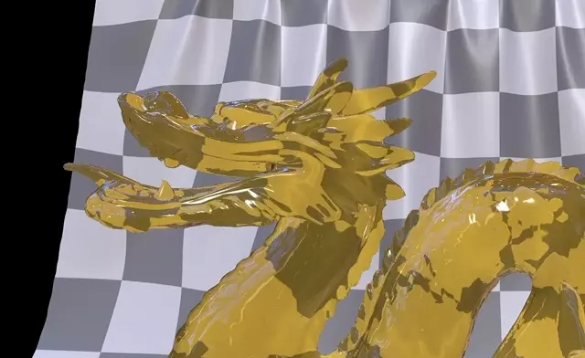</p>

&bull; KHR_materials_emissive_strength

&bull; KHR_materials_iridescence
<p>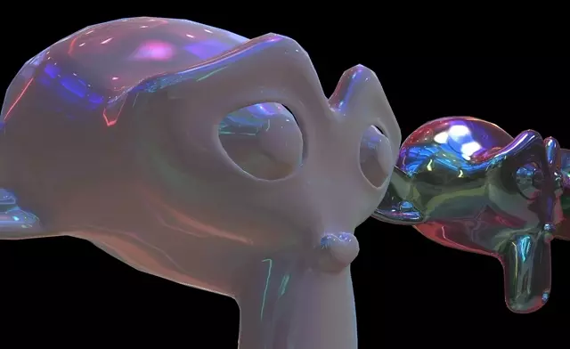</p>

&bull; KHR_materials_unlit

&bull; KHR_materials_variants
<p>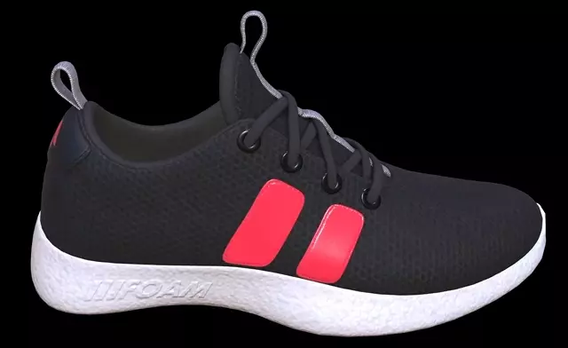</p>

&bull; KHR_mesh_quantization

&bull; KHR_texture_basisu

&bull; KHR_texture_transform

&bull; EXT_lights_image_based
<p>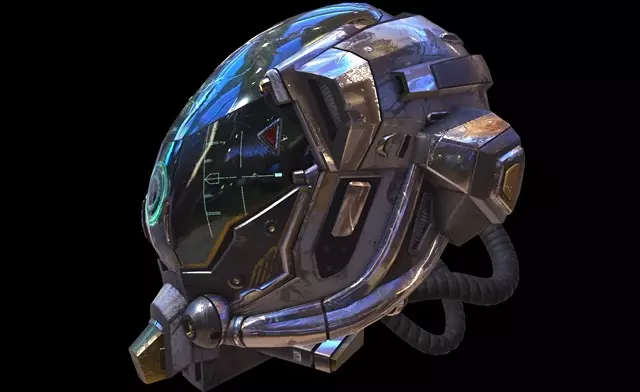</p>

&bull; KHR_materials_ior
<p>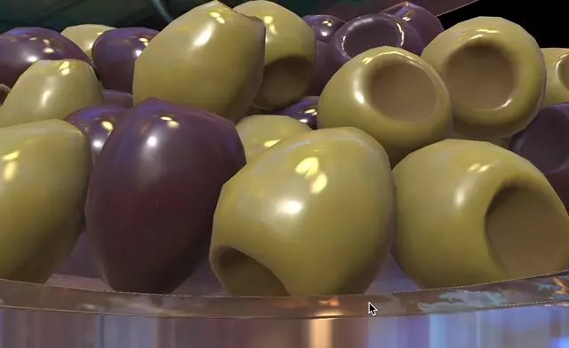</p>

[Check list](https://github.com/cx20/gltf-test)

## Platforms

&bull; Browsers with WebGL 2.0 support

&bull; Browsers with WebGPU support (Chrome 113 and above)

&bull; Node.js renderless

## How to convert 3D model to gltf

&bull; Blender 2.80 File -> Export -> glTF 2.0

&bull; [Sketchfab](https://sketchfab.com/models?features=downloadable&sort_by=-likeCount) 100,000+ models

## Usage

```js
<canvas style="width: 600px; height: 600px;"></canvas>

const renderer = new RedCube('./box.gltf', canvas);
renderer.init(() => {
    console.log('loaded');
});
```

## Install
```
npm install redcube.js
```
